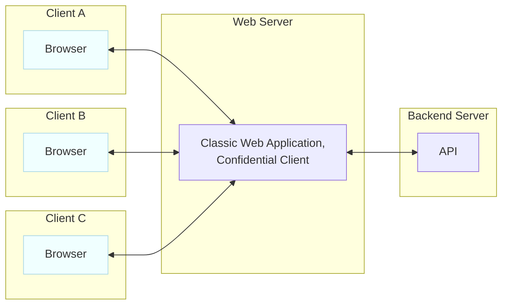
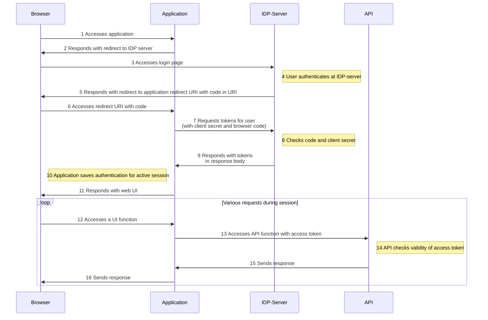
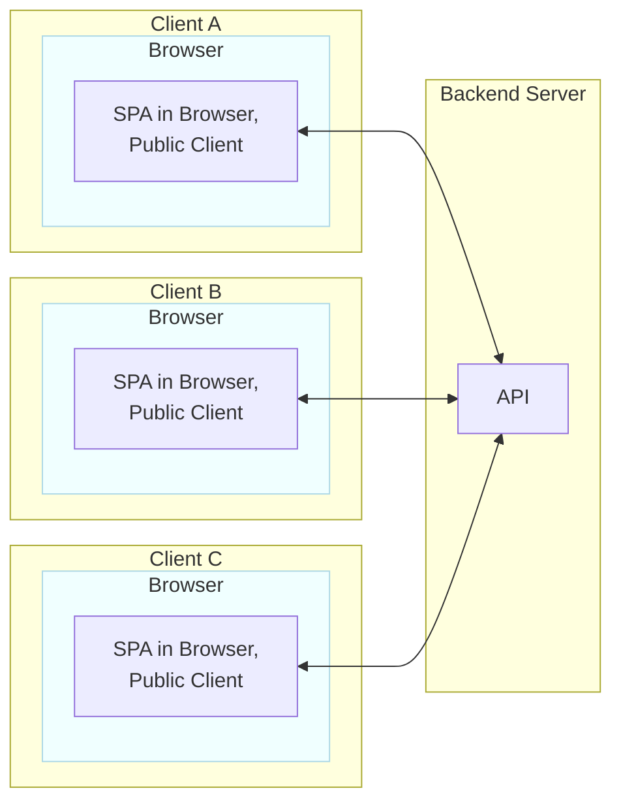
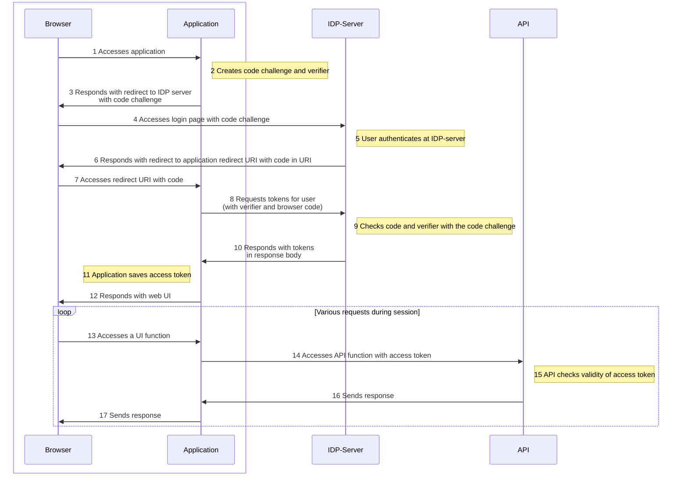

#  OpenId Connect Authorization Code Flow

OpenID Connect (OIDC) is based on the OAuth 2.0 protocol. The OpenID Connect Authorization Code Flow is one way to provide authentication and authorization for a web application with the help of an identity provider (IDP). The IDP can be a third party as Entra ID or Auth0. You can also provide it with your own server, e.g. in form of a keycloak application. Independent of your choice: The authentication and authorization is not provided by the web application itself. This has advantages:

* No user management in every single application
* Use of application with high reliability
* Easy inclusion of different authentication methods
* Possibility to include other authentication provider as Google, Github etc.

You have to adapt the authentication and authorization process to the different use cases. Most importantly, you must consider the role of the browser in the architecture. Because information in URI or in the browser is possibly accessible. Therefore you should consider it as public information.

# Classic Web App (Confidential Client)

The classic web app works as follows:
* The client navigates with the browser to the URI of the web application
* The web server provides the web application
* The client requests information from the web server, the web server server requests these information from an API, the API sends the requested information to the web sever, and the web server provides this information to the client

The Authorization Code Flow for a Classic Web App works as follows:

Important:  

* The user authenticates at the IDP server with a password or another form of authentication, the web application is not aware of (step 4)
* The application authenticates at the IDP server with a secret, the browser is not aware of (step 7)

Remember: You have to consider all information saved in the Browser as public, the code is transmitted in the URI and is therefore possibly accessible to the a third party (e.g. in the browser chronic).
* The code is kind of a ticket that connects the authentication process of the user with the authentication process of the application. The IDP server only sends the tokens to the application when all information in its database and the secrets match (step 8). The code alone is therefore not enough to authenticate the user to the application

The access token to other APIs is send the to web application that is not publicly available and not available for the browser.

# Single Page App (Public Client)

The huge difference between a regular web application and a progressive web app is that the application doesn't run on a server but on the client in the browser. The application is therefore a public client.

The authentication workflow for SPA has following problem:

* The application cannot have a fixed secret, since it is possibly publicly available, the authorization code flow as described for the classic web application does not work with this architecture

The solution to solve this problem is the PKCE (Proof Key for Code Exchange):

* The application in the browser creates for each authentication process a unique PKCE consisting of a code challenge and a code verifier (step 2).
* The code challenge is added to the login process at the IDP server (step 3)
* When the applications requests the tokens (step 8), the IDP server can verify whether it is the same browser and the same instance of the application that issued the code challenge (step 9)
* Make sure that the access token is stored only in the application and not in the local storage for additional security

